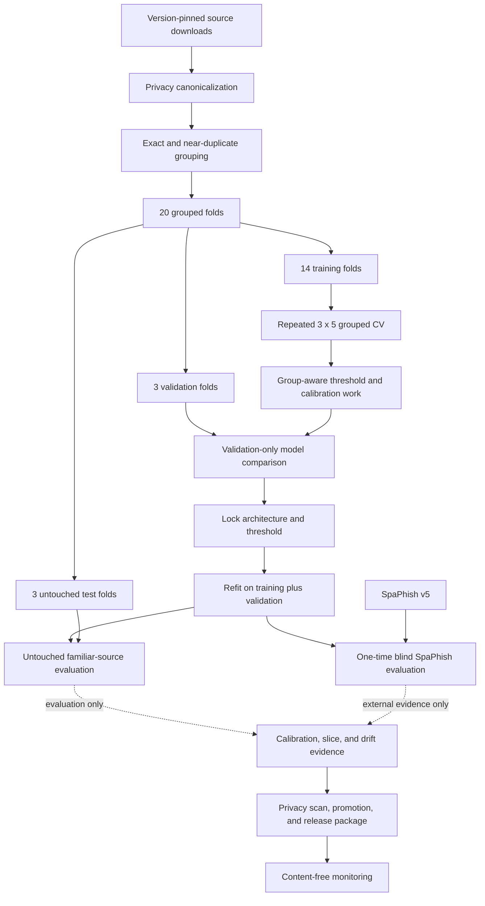
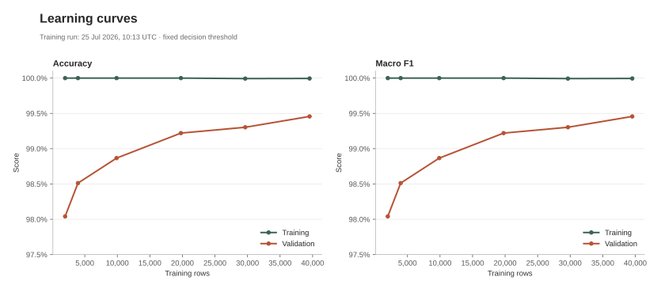
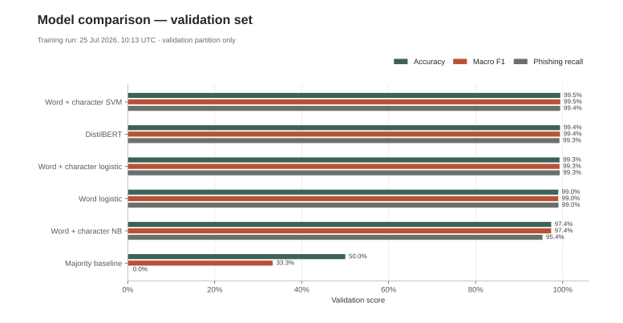
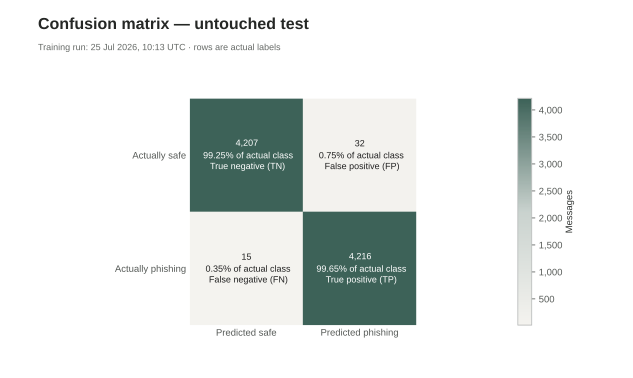
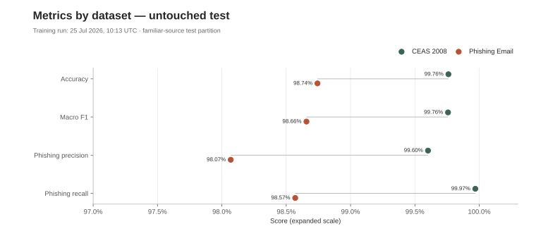

# Machine Learning Workflow

This workflow separates training decisions from untouched and external evidence. A high
same-source score is not treated as proof of production performance.

The one-way test and SpaPhish branches are the critical isolation boundary. Their
results can block or qualify a release, but cannot change this release's model,
threshold, calibration, or training data.

## 1. Inputs and canonical schema

The two version-pinned training inputs map to `text`, binary `label`, `source`, and an
audit-only `row_id`. CEAS subject and body are combined. Unknown or missing labels fail
the audit.

Only privacy-canonicalized `text` is passed to a vectorizer or transformer. Source,
labels, timestamps, group IDs, row IDs, and diagnostic slices are never model features.

Text preparation applies Unicode NFKC, null removal, whitespace normalization, and a
100,000-character head/tail limit. Email local parts, phone/account-like identifiers,
and URL query values are replaced before feature extraction.

## 2. Exact and near-duplicate control

Before any split:

1. empty messages are removed;
2. exact normalized text is SHA-256 hashed;
3. conflicting-label hash groups are removed completely;
4. same-label exact duplicates keep one deterministic row;
5. a separate masked view replaces volatile emails, URLs, and numbers;
6. word trigrams are represented by 128-permutation MinHash;
7. LSH produces candidates;
8. candidates are joined only when exact trigram Jaccard similarity is at least `0.85`.

Connected candidate pairs form one `similarity_group`. The split verifier fails if an
exact hash or similarity group crosses partitions.

## 3. Twenty-fold grouped split

`StratifiedGroupKFold` assigns source-and-label strata while treating each
`similarity_group` as indivisible. Random seed `42` creates 20 folds:

| Purpose | Folds |
|---|---:|
| Candidate training and repeated CV | 14 |
| Threshold/final validation | 3 |
| Untouched test | 3 |

The exact fold and group assignments are recorded in
`reports/<run-id>/split_assignments.csv`. Small synthetic unit-test datasets use fewer
folds but retain the same group-isolation assertions.

## 4. Stability-aware classical selection

The training partition alone runs three repetitions of five-fold grouped
cross-validation. Each outer fold contains an inner group-disjoint fit/threshold split.
The candidates are:

- word TF-IDF plus logistic regression;
- word/character TF-IDF plus logistic regression;
- word/character TF-IDF plus Complement Naive Bayes;
- word/character TF-IDF plus linear SVM.

Character-within-word n-grams are length 3–5. The SVM uses sigmoid probability
calibration with explicit group-disjoint calibration folds.

Candidates are ordered by:

1. mean outer-fold macro F1;
2. worst outer-fold macro F1;
3. mean phishing recall;
4. simplicity.

This prevents one unusually favorable validation fold from deciding the classical
winner. `grouped_cv_folds.csv` and `grouped_cv_summary.csv` retain the evidence.

## 5. Threshold and optional transformer

Thresholds are searched from `0.05` through `0.95` in steps of `0.005`, ordered by macro
F1, phishing recall, then closeness to `0.5`.

The optional DistilBERT candidate is trained only on the training partition, with
validation-based early stopping. A transformer or ensemble may replace the CV-selected
classical model only under the configured validation tolerance and ensemble gain rules.
No untouched or external result changes candidate, threshold, calibration, epoch, or
ensemble decisions.

## 6. Locked refit and untouched evaluation

After selection, training and validation are combined and the chosen architecture is
refit. The locked threshold is applied once to the untouched three folds.

Reported metrics include:

- accuracy and macro F1;
- phishing precision, recall, and F1;
- PR-AUC and ROC-AUC;
- false-positive rate and confusion matrix;
- Brier score and log loss;
- ten-bin expected calibration error and reliability data;
- per-source and privacy-hashed domain/campaign slices.

Manifest schema 2 records grouping settings, calibration, monitoring baselines,
dependencies, dataset hashes, report hashes, the model hash, and privacy-scan evidence.
Inference remains compatible with schema 1 artifacts.

### Release diagnostics

The checked-in SVGs are generated from run `20260725T101318Z`; the JSON and CSV reports
remain untracked because they contain detailed generated run state.

## 7. Blind SpaPhish v5 evaluation

SpaPhish v5 is downloaded independently and never joined with training. The evaluation
adapter verifies:

- exactly 1,395 rows;
- 664 legitimate and 731 phishing labels;
- official file SHA-256;
- parseable canonical fields.

The locked model evaluates all rows at their observed prevalence. Reports include:

- overall metrics;
- 2014–2023, 2024, and 2025 periods;
- Spanish-language drift;
- message length, HTML/plain, URL, obfuscation, attachment, source, domain, and campaign
  slices;
- a reliability curve.

The prevalence is explicitly not claimed to represent every production inbox.
`external_evaluation.lock.json` prevents accidental repeated use of external evidence
for iterative tuning.

For release run `20260725T101318Z`, the blind result is 48.87% macro F1, 96.99%
phishing recall, 55.96% phishing precision, and an 84.04% false-positive rate. This is
evidence of severe domain and calibration drift, not evidence that the model is ready
for production. The full result and year/language slices are documented in the model
card and generated generalization report.

## 8. Robustness diagnostics

The validation model is scored on deterministic:

- whitespace changes;
- selected Latin/Cyrillic homoglyph substitutions;
- URL-query changes;
- appended call-to-action language.

Each report includes absolute probability shift and decision-flip fraction. These
diagnostics expose weaknesses; they do not improve generalization unless a later,
training-only experiment measures a benefit. Untouched and external results are never
fed back into this release's model.

## 9. Campaign, domain, temporal, and slice limits

Registrable sender and URL domains are extracted with an offline public-suffix snapshot.
Reports store only stable SHA-256-derived IDs, not raw domains. Campaign IDs hash the set
of observed domain IDs.

Training timestamps are incomplete and source-specific, so no defensible chronological
training split is claimed. Time-separated evidence comes from the locked external
SpaPhish periods. This limitation remains in the model card.

## 10. Monitoring and retraining

The schema-2 baseline stores score-bin and slice fractions but no message content.
`monitor --input batch.jsonl` rejects content fields and calculates score PSI, predicted
prevalence drift, slice drift, and optional labeled performance.

Default triggers:

- score PSI at least `0.20`;
- predicted prevalence absolute change at least `0.10`;
- slice fraction absolute change at least `0.15`;
- labeled macro-F1 drop at least `0.05`.

See [monitoring and rollback](MONITORING_AND_ROLLBACK.md).

## 11. Promotion and release

`promote` validates schema 2, payload hashes, report completeness, external lock, and the
artifact privacy scan before atomically updating `latest.json`. Every promotion is added
to a history file; `--rollback` revalidates and restores the previous model atomically.

`package-release` includes only:

- model payload and schema-2 manifest;
- metrics, grouped-CV summary, generalization report, and reliability diagram;
- model card, model license, dataset notices, and security policy;
- internal and outer SHA-256 sums.

Raw CSV, EML, logs, secrets, and unrestricted artifacts fail the release gates.

## 12. What improves generalization

The following can directly improve model choice or reduce shortcut learning:

- exact and near-duplicate group isolation;
- grouped repeated CV and worst-fold selection;
- group-aware calibration;
- privacy canonicalization of volatile identifiers;
- more varied, independently collected training data.

The following primarily measure reliability and reveal limitations:

- untouched and external evaluation;
- time/domain/campaign/slice reports;
- calibration metrics and reliability diagrams;
- perturbation tests and drift monitoring.

They are necessary release evidence, but are not described as model improvements unless
training-only measurements show an improvement.
